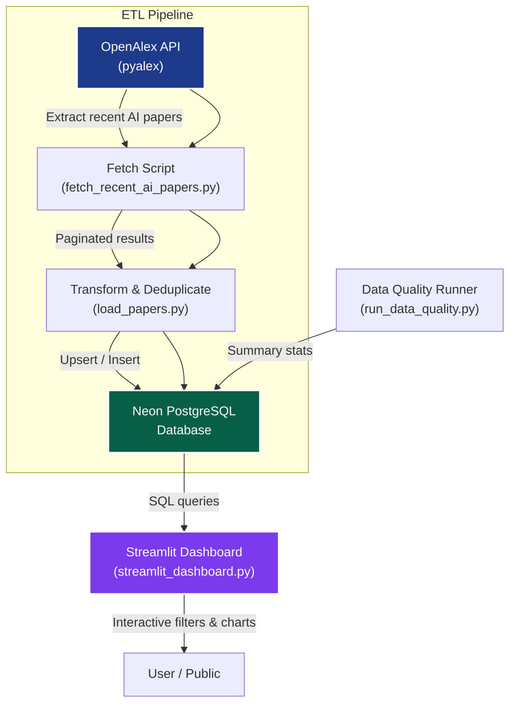
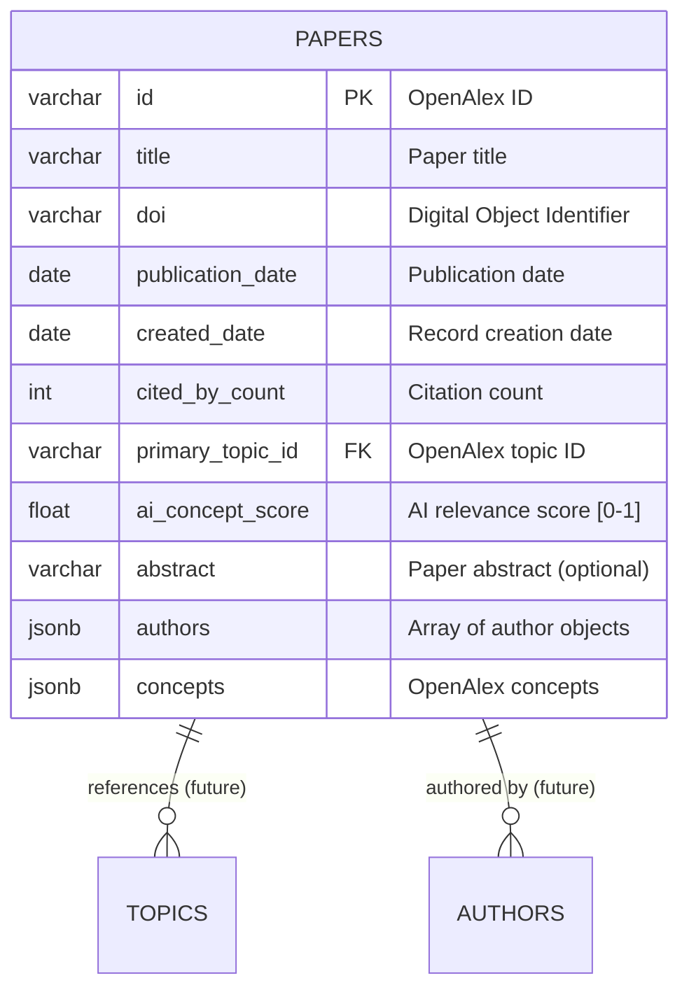

# Market Data Pipeline – AI Academic Papers Tracker

https://market-data-pipeline-6u2ncxrf6rctktgzwaluzv.streamlit.app/


*(Modern ETL pipeline fetching AI-related papers from OpenAlex → PostgreSQL (Neon) → Streamlit Dashboard)*

This project demonstrates a clean, production-ready **Python data pipeline** that:

- Extracts recent AI/ML papers using the **OpenAlex API** (via `pyalex`)
- Stores deduplicated, quality-checked data in a serverless **PostgreSQL** database (Neon)
- Provides real-time visualization and exploration via a **Streamlit** dashboard

Built with modern practices: virtual environments, environment variables for secrets, data quality checks, and AI-assisted development using **Cursor**.

## Features

- Automated fetching & pagination handling from OpenAlex
- Deduplication by DOI / OpenAlex ID
- Lightweight data quality framework (completeness, consistency, outliers)
- Secure credential management via `.env`
- Streamlit dashboard for browsing papers, stats, and trends
- Easy local & cloud deployment (Streamlit Community Cloud)

## Project Structure

```mermaid
market-data-pipeline/
├── src/
│   ├── __init__.py
│   ├── database.py               # Neon PostgreSQL connection & queries
│   ├── fetch_recent_ai_papers.py # OpenAlex extraction logic
│   ├── load_papers.py            # Insert / upsert to DB with dedup
│   ├── pipeline.py               # Main orchestrator script
│   ├── run_data_quality.py       # DQ report runner
│   ├── streamlit_dashboard.py    # Dashboard entrypoint
│   └── ... (other helpers)
├── sql/                          # SQL scripts & queries (if any)
├── .env.example                  # Template for environment variables
├── .gitignore
├── requirements.txt
├── README.md
└── run_data_quality.py           # (can be at root or in src/)
```

## Vibe Coding Setup Checklist: Essential Tools

Before building, set up these free-tier services:

- **GitHub** account → host code & Streamlit integration
- **Streamlit** account (sign in with GitHub) → free cloud hosting
- **Cursor** IDE → AI-powered editor (download from cursor.sh)
- **Neon** serverless PostgreSQL → create a project, get connection string

**Verification checklist**:
- [ ] GitHub repo created
- [ ] Streamlit linked to GitHub
- [ ] Cursor installed
- [ ] Neon DB ready (save connection string in `.env`)

**Security note**: Never commit secrets. Use `.env` + `.gitignore`.

## Installation & Setup

1. Clone the repo
   ```bash
   git clone https://github.com/yourusername/market-data-pipeline.git
   cd market-data-pipeline
   ```

2. Create & activate virtual environment
   ```bash
   python3 -m venv .venv
   source .venv/bin/activate   # Windows: .venv\Scripts\activate
   ```

3. Install dependencies
   ```bash
   pip install -r requirements.txt
   ```

4. Copy example env and fill in your Neon credentials
   ```bash
   cp .env.example .env
   # Edit .env → add NEON_DATABASE_URL=postgresql://...
   ```

5. (Recommended) Update `requirements.txt` to modern versions:
   ```
   streamlit>=1.55.0
   pyalex>=0.18
   pandas>=2.3.3
   psycopg2-binary>=2.9.9
   python-dotenv
   requests
   ```

## Usage

### Run the full pipeline (fetch → load → quality check)

```bash
python src/pipeline.py
# or with args if implemented: python src/pipeline.py --days 30
```

### Check data quality

```bash
python run_data_quality.py
```

### Launch the Streamlit dashboard locally

```bash
streamlit run src/streamlit_dashboard.py
```

Deploy to Streamlit Cloud: connect your GitHub repo → set main file to `src/streamlit_dashboard.py` → add secrets for `NEON_DATABASE_URL`.

## Pipeline Architecture

Modern ETL layers with separation of concerns:

- **Extract**: OpenAlex API (`pyalex`) → filtered AI papers
- **Transform**: Deduplication, basic cleaning, AI concept scoring (if added)
- **Load**: Upsert to Neon PostgreSQL
- **Visualize**: Streamlit dashboard (real-time queries)

**Data quality safeguards**:
- Deduplication logic
- Comprehensive checks (missing fields, negative citations, date anomalies, etc.)
- Environment variable secrets

### Flow Diagram


### Entity-Relationship Diagram (ERD) – `papers` table (simplified)

Your current schema focuses on a single main table (`papers`) with these key fields. Future expansion could add Authors, Topics, etc.



**Note**: Currently a flat `papers` table. Relationships (authors, topics, institutions) can be normalized later by adding separate tables.

## Data Quality Report – `papers` table

Built-in checks for:

- Completeness (missing ID/title/topic)
- Citation anomalies (negative / extreme values)
- Date consistency
- Duplicate IDs / DOIs
- AI score bounds [0,1]

Run with `python run_data_quality.py` to see live metrics.

Core SQL summary (see code for full implementation):

```sql
SELECT
  COUNT(*) AS total_papers,
  COUNT(*) FILTER (WHERE id IS NULL) AS missing_id,
  ...
FROM papers;
```

## Development Tips

- Use **Cursor Agent mode** for multi-step tasks (e.g., "add tests", "refactor pipeline")
- Commit often with clear messages: `Add deduplication logic to load_papers`
- Keep `.env` in `.gitignore`
- Test locally before pushing to trigger Streamlit redeploy

## License

MIT (or your choice)

Happy pipelining! 🚀
